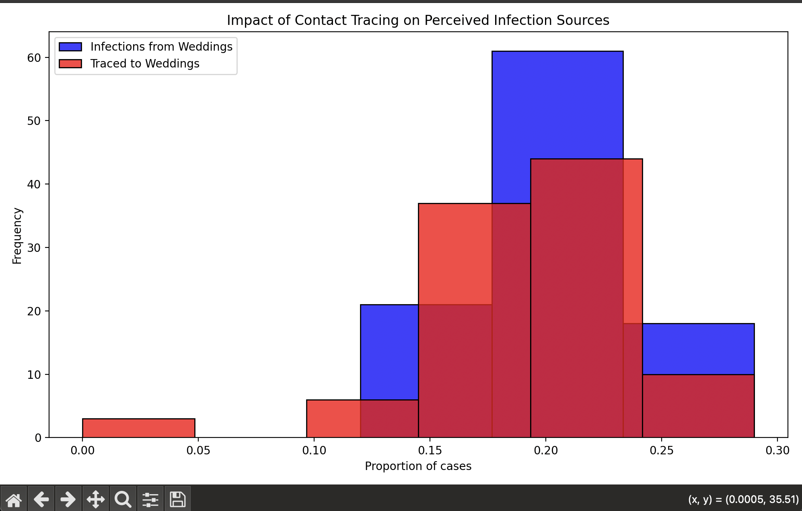
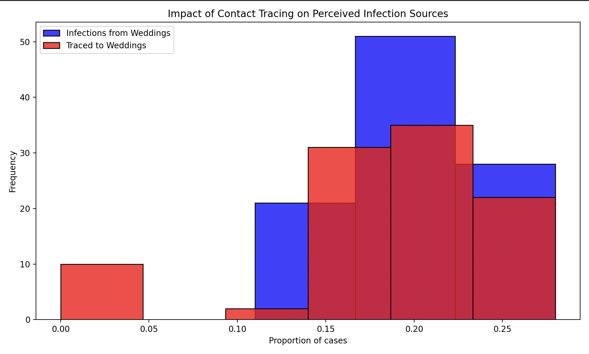
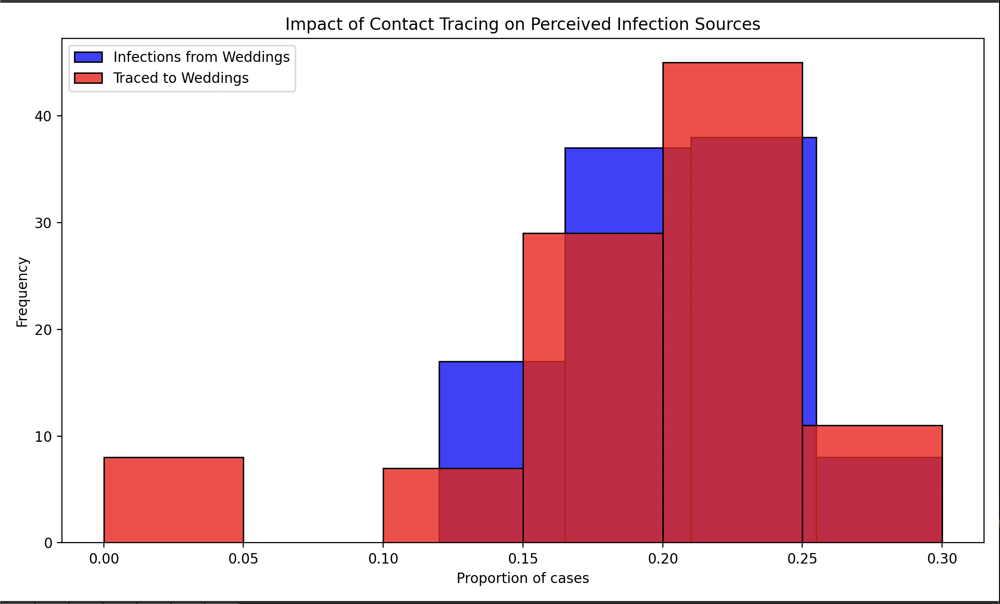

# ASSIGNMENT: Sampling and Reproducibility in Python

Read the blog post [Contact tracing can give a biased sample of COVID-19 cases](https://andrewwhitby.com/2020/11/24/contact-tracing-biased/) by Andrew Whitby to understand the context and motivation behind the simulation model we will be examining.

Examine the code in `whitby_covid_tracing.py`. Identify all stages at which sampling is occurring in the model. Describe in words the sampling procedure, referencing the functions used, sample size, sampling frame, any underlying distributions involved, and how these relate to the procedure outlined in the blog post.

Run the Python script file called whitby_covid_tracing.py as is and compare the results to the graphs in the original blog post. Does this code appear to reproduce the graphs from the original blog post?

Modify the number of repetitions in the simulation to 100 (from the original 1000). Run the script multiple times and observe the outputted graphs. Comment on the reproducibility of the results.

Alter the code so that it is reproducible. Describe the changes you made to the code and how they affected the reproducibility of the script file. The output does not need to match Whitby’s original blogpost/graphs, it just needs to produce the same output when run multiple times

# Author: Evgenia Kveliashvili

```
Sampling process occures twice in the simulation: first time when we ran primary contact tracing and second time - when we model secondary contact tracing.
Sampling procedure in the attached model is as follows: 
- first we calculate the total number of people who will get affected based on the set infection rate of 10%
-then we randomly pick 20% of people who are considered succesfully traced back to the event where they got sick (using the formula np.random.rand(sum(ppl['infected'])))
- third we execute the calculation of seconday tracing in which we take infected people and trace them back to the event, and if 2 or more infected people got infected in the same time at the same event, then other cases (if people visited the same event as well) will be traced back and assosiated with the the same source of infection()
- third we execute the calculation of seconday tracing in which we take succesfully traced infected people and trace them back to the event, and if 2 or more infected people got infected in the same time at the same event, then other cases (if people visited the same event as well) will be traced back and assosiated with the the same source of infection( event_trace_counts[event_trace_counts >= SECONDARY_TRACE_THRESHOLD].index)

Sample size in primary tracing is 20% of the total infected people (which in turn is 10% of 1000 people), sample size of secondary tracing assumes that if 2 more people who succesfully traced to the same event, then other un traced people from the same event will traced to that event.

Sampling frame is all people who attented weddings and brunches

I think we have binomial distribution in this model as it refers to the success/failure rate of succesful traces cases


After running Pyhton script I noticed that the graph repeats the graphs from the blog. The model represents the same results as described in blog  - the true proportion of positive cases is lower than the observed proportion of the cases traced to the wedding

After that I have modified the script to 100 repetions and run it several times (some of the images are attached below)
 
While the mean distribution was aorun the same range between 15 and 25% of positive cases traced to wedding, every time I ran the code the graph was slighly different. In order to make sure that simulation is reproducible I have added random seed to allow the same graph to be produced every time someone uses the code
```


## Criteria

|Criteria|Complete|Incomplete|
|--------|----|----|
|Altercation of the code|The code changes made, made it reproducible.|The code is still not reproducible.|
|Description of changes|The author explained the reasonings for the changes made well.|The author did not explain the reasonings for the changes made well.|

## Submission Information

🚨 **Please review our [Assignment Submission Guide](https://github.com/UofT-DSI/onboarding/blob/main/onboarding_documents/submissions.md)** 🚨 for detailed instructions on how to format, branch, and submit your work. Following these guidelines is crucial for your submissions to be evaluated correctly.

### Submission Parameters:
* Submission Due Date: `23:59 - 16/02/2025`
* The branch name for your repo should be: `assignment-1`
* What to submit for this assignment:
    * This markdown file (a1_sampling_and_reproducibility.md) should be populated.
    * The `whitby_covid_tracing.py` should be changed.
* What the pull request link should look like for this assignment: `https://github.com/<your_github_username>/sampling/pull/<pr_id>`
    * Open a private window in your browser. Copy and paste the link to your pull request into the address bar. Make sure you can see your pull request properly. This helps the technical facilitator and learning support staff review your submission easily.

Checklist:
- [ x ] Create a branch called `assignment-1`.
- [ x ] Ensure that the repository is public.
- [ x ] Review [the PR description guidelines](https://github.com/UofT-DSI/onboarding/blob/main/onboarding_documents/submissions.md#guidelines-for-pull-request-descriptions) and adhere to them.
- [ x ] Verify that the link is accessible in a private browser window.

If you encounter any difficulties or have questions, please don't hesitate to reach out to our team via the help channel in Slack. Our Technical Facilitators and Learning Support staff are here to help you navigate any challenges.
